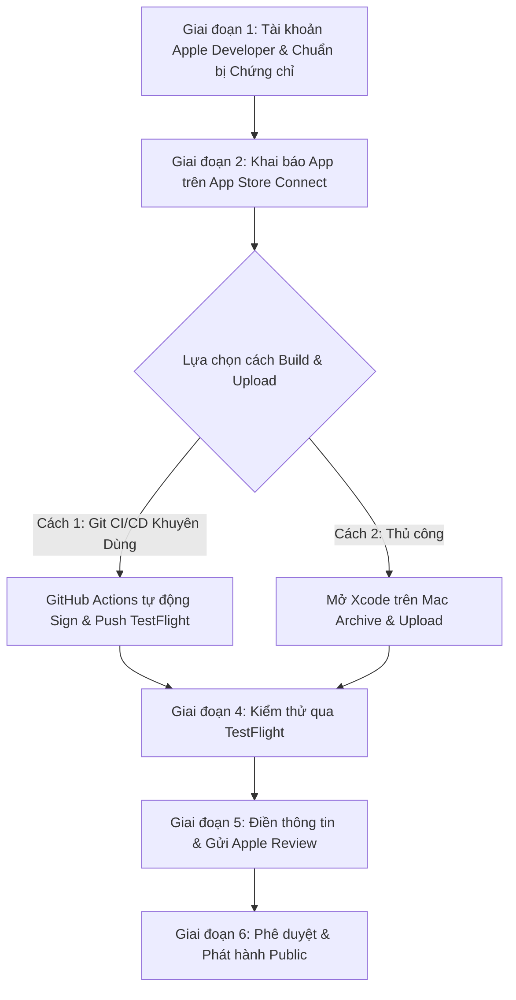

# HƯỚNG DẪN QUY TRÌNH ĐẨY ỨNG DỤNG IOS LÊN APPLE APP STORE (TỪ A - Z)

> **Dành cho dự án:** `XTTech Mobile App` (Capacitor / Next.js Hybrid)  
> **Bundle Identifier:** `com.xttech.app2`  
> **Phương thức triển khai:** Hỗ trợ cả **Git CI/CD (GitHub Actions macOS Runner)** và **Xcode trên máy Mac Local**  
> **Thời gian cập nhật:** 2026

---

## 📌 TỔNG QUAN CÁC GIAI ĐOẠN



---

## 🏢 GIAI ĐOẠN 1: TÀI KHOẢN APPLE DEVELOPER & CHỨNG CHỈ KÝ SỐ

### 1.1. Tài khoản Apple Developer Program
- Đăng ký tại [developer.apple.com](https://developer.apple.com/programs/) ($99 USD / năm).
- Có thể dùng tài khoản **Cá nhân** hoặc **Doanh nghiệp (Organization - khuyên dùng)**.

### 1.2. Môi trường Build: Bạn build qua Git (GitHub Actions)
- Bạn **KHÔNG BẮT BUỘC** phải có máy Mac vật lý nếu sử dụng **GitHub Actions** với runner `macos-14` (như trong workflow `.github/workflows/build-ios-unsigned.yml` hiện tại của bạn).
- ⚠️ **LƯU Ý CỐT LÕI VỀ FILE IPA:**
  - File IPA hiện tại bạn build trên Git là **Unsigned IPA** (`CODE_SIGNING_ALLOWED=NO`). Bản này chỉ dùng để test nội bộ qua các công cụ jailbreak/sideloading (TrollStore, AltStore).
  - **Để đưa lên App Store / TestFlight:** Apple **bắt buộc** IPA phải được **Ký số (Code Signing)** bằng **Apple Distribution Certificate** và **App Store Provisioning Profile**.

---

## 🔑 GIAI ĐOẠN 2: TẠO CHỨNG CHỈ & CẤU HÌNH GITHUB SECRETS CHO CI/CD

Để Git (GitHub Actions) tự động ký số và upload thẳng lên App Store Connect, bạn cần chuẩn bị 3 thành phần sau trên [developer.apple.com](https://developer.apple.com):

### 2.1. Chuẩn bị Chứng chỉ & Profile (Làm 1 lần duy nhất)

1. **Apple Distribution Certificate (`.p12`):**
   - Vào **Certificates, Identifiers & Profiles** -> **Certificates** -> Nhấn **`+`** -> Chọn **Apple Distribution** -> Tạo chứng chỉ.
   - Xuất file chứng chỉ kèm Private Key dưới dạng file `.p12` và đặt mật khẩu bảo vệ (ví dụ: `CertPassword123`).
2. **App Identifier & Capabilities:**
   - Vào mục **Identifiers** -> Chọn/Tạo App ID `com.xttech.app2`.
   - Bật các Capabilities cần thiết (ví dụ: *Access WiFi Information*, *Push Notifications* nếu có).
3. **Provisioning Profile (`.mobileprovision`):**
   - Vào mục **Profiles** -> Nhấn **`+`** -> Chọn **App Store** (trong mục Distribution) -> Chọn App ID `com.xttech.app2` và Certificate vừa tạo -> Tải file `.mobileprovision` về máy.
4. **App Store Connect API Key (`.p8` - Dùng để Git tự động upload):**
   - Truy cập [appstoreconnect.apple.com](https://appstoreconnect.apple.com/) -> Vào tab **Users and Access** -> **Integrations** (hoặc **Keys**).
   - Nhấn **`+`** để tạo Key mới:
     - Tên: `GitHub-Actions-CI`
     - Quyền (Access): **Admin** hoặc **App Manager**.
   - Tải file `.p8` về (chỉ được tải 1 lần duy nhất).
   - Ghi lại 2 thông số: **Key ID** (ví dụ: `ABCD1234EF`) và **Issuer ID** (dạng UUID: `xxxxxxxx-xxxx-xxxx-xxxx-xxxxxxxxxxxx`).

### 2.2. Mã hóa Base64 và Lưu vào GitHub Secrets

Chuyển đổi các file trên thành chuỗi Base64:
- **Trên Windows PowerShell:**
  ```powershell
  # Chuyển đổi Certificate .p12 sang base64
  [Convert]::ToBase64String([IO.File]::ReadAllBytes("path\to\distribution.p12")) | Set-Clipboard

  # Chuyển đổi Provisioning Profile sang base64
  [Convert]::ToBase64String([IO.File]::ReadAllBytes("path\to\AppStore_com.xttech.app2.mobileprovision")) | Set-Clipboard

  # Chuyển đổi file App Store Connect API Key .p8 sang base64
  [Convert]::ToBase64String([IO.File]::ReadAllBytes("path\to\AuthKey_XXXXXX.p8")) | Set-Clipboard
  ```

- **Vào GitHub Repository:**
  - `Settings` ➡️ `Secrets and variables` ➡️ `Actions` ➡️ Nhấn **New repository secret** và thêm các biến:
    - `APPLE_CERTIFICATE_BASE64`: (Chuỗi base64 của file `.p12`)
    - `APPLE_CERTIFICATE_PASSWORD`: (Mật khẩu file `.p12`)
    - `APPLE_PROVISIONING_PROFILE_BASE64`: (Chuỗi base64 của file `.mobileprovision`)
    - `APPSTORE_API_KEY_BASE64`: (Chuỗi base64 của file `.p8`)
    - `APPSTORE_API_KEY_ID`: (Mã Key ID)
    - `APPSTORE_ISSUER_ID`: (Mã Issuer ID)

---

## 🤖 GIAI ĐOẠN 3: FILE WORKFLOW GITHUB ACTIONS BUILD & ĐẨY THẲNG LÊN TESTFLIGHT

Tạo file workflow mới tại: `.github/workflows/deploy-ios-testflight.yml`:

```yaml
name: Build & Upload to App Store / TestFlight

on:
  workflow_dispatch:
  push:
    branches: [ main, release ]

jobs:
  build-and-deploy:
    name: Build Signed IPA and Upload to TestFlight
    runs-on: macos-14

    steps:
      - name: 1. Checkout source code
        uses: actions/checkout@v4

      - name: 2. Setup Node.js 22
        uses: actions/setup-node@v4
        with:
          node-version: 22
          cache: 'npm'

      - name: 3. Install npm dependencies & Build Next.js
        run: |
          npm ci
          npm run build
          npx cap sync ios

      - name: 4. Install Apple Certificate & Provisioning Profile
        env:
          BUILD_CERTIFICATE_BASE64: ${{ secrets.APPLE_CERTIFICATE_BASE64 }}
          P12_PASSWORD: ${{ secrets.APPLE_CERTIFICATE_PASSWORD }}
          BUILD_PROVISION_PROFILE_BASE64: ${{ secrets.APPLE_PROVISIONING_PROFILE_BASE64 }}
          KEYCHAIN_PASSWORD: "temp_keychain_password_123"
        run: |
          # Tạo biến đường dẫn
          CERTIFICATE_PATH=$RUNNER_TEMP/build_certificate.p12
          PP_PATH=$RUNNER_TEMP/build_pp.mobileprovision
          KEYCHAIN_PATH=$RUNNER_TEMP/app-signing.keychain-db

          # Giải mã certificate và provisioning profile từ Base64
          echo -n "$BUILD_CERTIFICATE_BASE64" | base64 --decode -o $CERTIFICATE_PATH
          echo -n "$BUILD_PROVISION_PROFILE_BASE64" | base64 --decode -o $PP_PATH

          # Tạo temporary keychain trên máy ảo macOS
          security create-keychain -p "$KEYCHAIN_PASSWORD" $KEYCHAIN_PATH
          security set-keychain-settings -lut 21600 $KEYCHAIN_PATH
          security unlock-keychain -p "$KEYCHAIN_PASSWORD" $KEYCHAIN_PATH

          # Import certificate vào keychain
          security import $CERTIFICATE_PATH -P "$P12_PASSWORD" -A -t cert -f pkcs12 -k $KEYCHAIN_PATH
          security list-keychain -d user -s $KEYCHAIN_PATH

          # Cài đặt Provisioning Profile vào thư mục hệ thống
          mkdir -p ~/Library/MobileDevice/Provisioning\ Profiles
          cp $PP_PATH ~/Library/MobileDevice/Provisioning\ Profiles/

      - name: 5. Build Archive & Export Signed IPA
        run: |
          cd ios/App
          
          # Build Archive với Code Signing
          xcodebuild clean archive \
            -project App.xcodeproj \
            -scheme App \
            -destination 'generic/platform=iOS' \
            -configuration Release \
            -archivePath "$RUNNER_TEMP/App.xcarchive"

          # Tạo file cấu hình Export Options
          cat <<EOF > $RUNNER_TEMP/ExportOptions.plist
          <?xml version="1.0" encoding="UTF-8"?>
          <!DOCTYPE plist PUBLIC "-//Apple//DTD PLIST 1.0//EN" "http://www.apple.com/DTDs/PropertyList-1.0.dtd">
          <plist version="1.0">
          <dict>
              <key>method</key>
              <string>app-store</string>
              <key>signingStyle</key>
              <string>automatic</string>
              <key>uploadSymbols</key>
              <true/>
          </dict>
          </plist>
          EOF

          # Export IPA đã được ký chuẩn App Store
          xcodebuild -exportArchive \
            -archivePath "$RUNNER_TEMP/App.xcarchive" \
            -exportOptionsPlist "$RUNNER_TEMP/ExportOptions.plist" \
            -exportPath "$RUNNER_TEMP/output"

      - name: 6. Upload IPA to App Store Connect / TestFlight
        env:
          APPSTORE_API_KEY_BASE64: ${{ secrets.APPSTORE_API_KEY_BASE64 }}
          API_KEY_ID: ${{ secrets.APPSTORE_API_KEY_ID }}
          API_ISSUER_ID: ${{ secrets.APPSTORE_ISSUER_ID }}
        run: |
          # Lưu private key API
          mkdir -p ~/.appstoreconnect/private_keys
          echo -n "$APPSTORE_API_KEY_BASE64" | base64 --decode -o ~/.appstoreconnect/private_keys/AuthKey_${API_KEY_ID}.p8

          # Dùng altool tải IPA trực tiếp lên App Store Connect
          xcrun altool --upload-app \
            --type ios \
            --file "$RUNNER_TEMP/output/App.ipa" \
            --apiKey "$API_KEY_ID" \
            --apiIssuer "$API_ISSUER_ID"
```

> 💡 **Kết quả:** Mỗi khi bạn `git push` lên branch `main` hoặc bấm `Run workflow`, GitHub Actions sẽ tự động biên dịch, ký số và nạp bản build trực tiếp vào tài khoản **App Store Connect** của bạn mà không cần đụng vào máy Mac.

---

## 🌐 GIAI ĐOẠN 4: KHAI BÁO THÔNG TIN TRÊN APP STORE CONNECT

Sau khi bản build đầu tiên được upload thành công lên App Store Connect:

1. Truy cập [appstoreconnect.apple.com](https://appstoreconnect.apple.com/) -> Vào **My Apps** -> Nhấn **`+`** (New App):
   - **Bundle ID:** Chọn `com.xttech.app2`.
   - **Name:** `XTTech` (hoặc `XTTech - Quản lý công trình & Chấm công`).
   - **SKU:** `xttech-ios-01`.
2. **Chuẩn bị hình ảnh Screenshots & Icon:**
   - **Icon:** `1024 x 1024 px` (PNG không trong suốt).
   - **Screenshots:** Tối thiểu 3 ảnh kích thước `1290 x 2796 px` (Màn hình 6.7" / 6.9" iPhone 15/16 Pro Max).
3. **Chính sách & Bản quyền:**
   - **Privacy Policy URL (Bắt buộc):** `https://xttech.vn/privacy-policy` (Trang chính sách bảo mật).
   - **App Privacy:** Khai báo thu thập *Location* (vị trí chấm công) và *Photos/Camera* (ảnh công trình, selfie).

---

## 🧪 GIAI ĐOẠN 5: KIỂM THỬ BETA TRÊN TESTFLIGHT

1. Mở tab **TestFlight** trên App Store Connect.
2. Bản build vừa đẩy từ Git sẽ chuyển từ trạng thái `Processing` sang `Ready to Test` (sau khoảng 10-20 phút).
3. Thêm email của bạn/khách hàng vào mục **Internal Testing** hoặc **External Testing**.
4. Mở app **TestFlight** trên iPhone thật ➡️ Nhấn **Install** để test thử:
   - Thử đăng nhập, nhận diện token.
   - Thử tính năng chấm công GPS, cấp quyền định vị "Khi dùng app" và "Luôn luôn".
   - Thử camera chụp selfie và upload ảnh.

---

## 🚀 GIAI ĐOẠN 6: GỬI APPLE DUYỆT (APP STORE REVIEW)

1. Vào tab **App Store** -> Phiên bản `1.0.0 Prepare for Submission`.
2. Tại mục **Build**: Chọn bản build TestFlight đã test ổn định.
3. **Cung cấp App Review Information (Cực kỳ quan trọng để không bị từ chối):**
   - **Sign-in required:** Tích chọn Bắt buộc đăng nhập.
   - **User name / Password:** Cung cấp tài khoản test demo có sẵn dữ liệu (Ví dụ: `tester_apple@xttech.vn` / `Demo@123456`).
   - **Notes (Ghi chú duyệt):**
     > *"Ứng dụng XTTech là ứng dụng nội bộ dành cho nhân sự công trình và kỹ thuật viên. Tính năng Background Location được sử dụng để theo dõi lộ trình và xác định vị trí làm việc trong ca phục vụ chấm công minh bạch. Vui lòng đăng nhập bằng tài khoản demo được cung cấp ở trên và truy cập tab Chấm công để kiểm tra."*
4. Nhấn **Submit to App Review**.
5. Thời gian duyệt thường kéo dài từ **12h - 48h**.

---

## ⚠️ CHECKLIST 3 ĐIỀU KHOẢN DỄ BỊ REJECT ĐỐI VỚI DỰ ÁN XTTECH

| Điều khoản Apple | Yêu cầu | Cách khắc phục trong XTTech |
| :--- | :--- | :--- |
| **Guideline 5.1.1(v) (Account Deletion)** | Bắt buộc app có đăng nhập phải có tính năng xóa tài khoản. | Thêm nút *"Xóa tài khoản / Yêu cầu hủy tài khoản"* trong trang Cài đặt / Thông tin cá nhân. |
| **Guideline 2.5.4 (Background Location)** | Giải trình rõ ràng mục đích sử dụng quyền vị trí chạy ngầm. | Đảm bảo `Info.plist` và phần App Review Notes mô tả rõ phục vụ chấm công trong ca. |
| **Guideline 2.1 (App Completeness)** | Backend phải luôn hoạt động 24/7 và tài khoản demo không được lỗi. | Đảm bảo server backend (`railway` / VPS) hoạt động ổn định trong suốt thời gian Apple review. |
