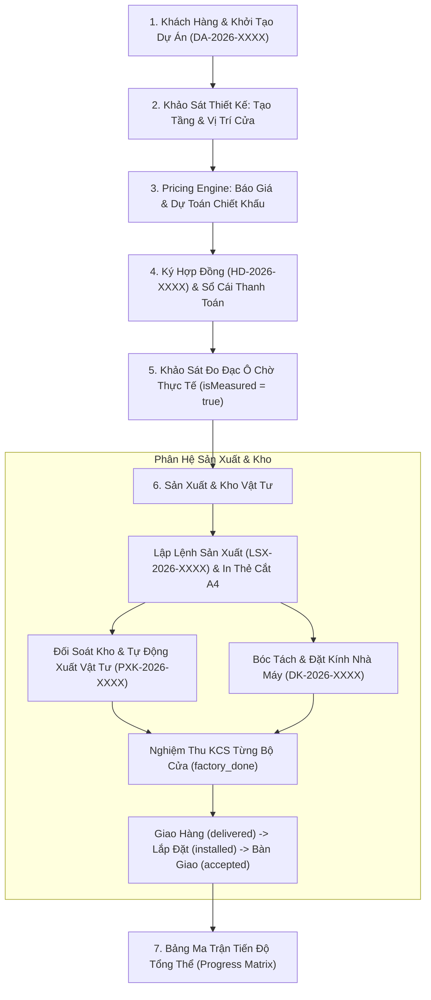

# TỔNG QUAN LUỒNG NGHIỆP VỤ & DANH MỤC API MASTER (STEP 2)

Tài liệu này cung cấp bức tranh toàn cảnh về luồng hoạt động xuyên suốt của hệ thống quản lý sản xuất nhôm kính XT-Tech (Step 2: Project Management & Manufacturing), đồng thời thiết lập **Danh mục kiểm tra toàn bộ 100% các API thực tế của Backend (API Master Checklist)**.

---

## 1. Bản Đồ Vòng Đời Dự Án (Project Lifecycle Flow)

Quy trình sản xuất nhôm kính từ giai đoạn tiếp nhận khách hàng đến bàn giao công trình tuân theo 6 chặng liên kết chặt chẽ:

---

## 2. Quy Chuẩn RESTful Router Prefix Của Backend

> [!IMPORTANT]
> Toàn bộ các tài nguyên thuộc phạm vi một dự án đều được thiết kế chuẩn RESTful lồng dưới tiền tố:
> **`/api/v1/projects/{project_id}/...`**
> Frontend bắt buộc phải truyền `project_id` trên URL Path (ví dụ: `/api/v1/projects/58/quotations`), tránh gọi URL dạng `/api/v1/quotations` sẽ bị lỗi **404 Not Found**.

---

## 3. Bảng Đối Soát Toàn Bộ API Backend Step 2 (Master Checklist)

Dưới đây là danh mục 100% các API của Step 2 đã được nạp trong FastAPI, tương ứng với tài liệu đặc tả chi tiết:

### Phân Hệ 1: Dự Án, Tầng & Vị Trí Cửa ([`001`](file:///e:/hoc_ve_fullstash/xttech/xttech-web-v2/docs/step2_project/001_khoi_tao_va_quan_ly_du_an.md) & [`002`](file:///e:/hoc_ve_fullstash/xttech/xttech-web-v2/docs/step2_project/002_tang_va_vi_tri_cua_khao_sat.md))
- `POST /api/v1/projects` - Khởi tạo dự án mới (201 Created)
- `GET /api/v1/projects` - Danh sách dự án (kèm phân trang, lọc status, search, metrics $m^2$, kg nhôm)
- `GET /api/v1/projects/{project_id}` - Chi tiết dự án (kèm cấu hình nhôm mặc định, danh sách tầng)
- `PUT /api/v1/projects/{project_id}` - Cập nhật dự án
- `DELETE /api/v1/projects/{project_id}` - Xóa mềm dự án
- `GET /api/v1/projects/{project_id}/activities` - Nhật ký lịch sử biến động dự án
- `GET /api/v1/projects/{project_id}/floors` - Danh sách tầng
- `POST /api/v1/projects/{project_id}/floors` - Tạo tầng mới
- `PUT /api/v1/projects/{project_id}/floors/{floor_id}` - Sửa thông tin tầng
- `DELETE /api/v1/projects/{project_id}/floors/{floor_id}` - Xóa tầng (chặn nếu tầng có cửa)
- `GET /api/v1/projects/{project_id}/positions` - Danh sách vị trí cửa theo tầng
- `POST /api/v1/projects/{project_id}/positions` - Thêm 1 vị trí cửa đơn lẻ
- `POST /api/v1/projects/{project_id}/positions/bulk` - Sinh cửa hàng loạt theo ma trận tầng
- `GET /api/v1/projects/{project_id}/positions/{position_id}` - Chi tiết 1 vị trí cửa
- `PUT /api/v1/projects/{project_id}/positions/{position_id}` - Cập nhật cửa (Optimistic locking: `revisionId`)
- `DELETE /api/v1/projects/{project_id}/positions/{position_id}` - Xóa vị trí cửa
- `PUT /api/v1/projects/{project_id}/positions/{position_id}/design` - Cập nhật thông số bóc tách thiết kế
- `POST /api/v1/projects/{project_id}/positions/{position_id}/duplicate` - Nhân bản vị trí cửa
- `PUT /api/v1/projects/{project_id}/positions/{position_id}/measure` - Khảo sát đo đạc thực tế (cảnh báo dung sai)
- `GET /api/v1/projects/positions/by-qr/{token}` - Tra cứu hiện trường bằng QR code (Public, không cần Bearer token)

### Phân Hệ 2: Báo Giá & Pricing Engine ([`003`](file:///e:/hoc_ve_fullstash/xttech/xttech-web-v2/docs/step2_project/003_bao_gia_va_pricing_engine.md))
- `POST /api/v1/projects/{project_id}/quotations/preview` - Live Pricing Engine (giá vốn, chiết khấu, nhân công, VAT, lãi gộp)
- `POST /api/v1/projects/{project_id}/quotations` - Lưu phương án báo giá chính thức kèm snapshot mBOM
- `GET /api/v1/projects/{project_id}/quotations` - Danh sách các phương án báo giá
- `GET /api/v1/projects/{project_id}/quotations/{quotation_id}` - Chi tiết phương án báo giá
- `PUT /api/v1/projects/{project_id}/quotations/{quotation_id}` - Cập nhật báo giá (chặn nếu đã ký HĐ)
- `DELETE /api/v1/projects/{project_id}/quotations/{quotation_id}` - Xóa báo giá
- `POST /api/v1/projects/{project_id}/quotations/{quotation_id}/clone` - Nhân bản phương án báo giá (Version 2, 3...)
- `POST /api/v1/projects/{project_id}/quotations/{quotation_id}/select` - Chốt phương án chính thức, đồng bộ vào dự án

### Phân Hệ 3: Hợp Đồng & Sổ Cái Thanh Toán ([`004`](file:///e:/hoc_ve_fullstash/xttech/xttech-web-v2/docs/step2_project/004_hop_dong_va_thanh_toan_so_cai.md))
- `POST /api/v1/projects/{project_id}/contracts` - Tạo hợp đồng kinh tế theo báo giá đã chốt
- `GET /api/v1/projects/{project_id}/contracts` - Danh sách hợp đồng chính và phụ lục
- `GET /api/v1/projects/{project_id}/contracts/{contract_id}` - Chi tiết hợp đồng & các đợt thanh toán
- `PATCH /api/v1/projects/{project_id}/contracts/{contract_id}` - Sửa thông tin hợp đồng
- `POST /api/v1/projects/{project_id}/contracts/appendices` - Tạo phụ lục hợp đồng phát sinh
- `POST /api/v1/projects/{project_id}/contracts/{contract_id}/sign` - Ký hợp đồng & khóa cứng báo giá liên kết
- `GET /api/v1/projects/{project_id}/payments` - Danh sách các mốc đợt thanh toán
- `GET /api/v1/projects/{project_id}/payments/ledger-summary` - Tổng kết sổ cái tài chính (Tổng giá trị, đã thu, còn nợ, tỷ lệ %)
- `GET /api/v1/projects/{project_id}/payments/transactions` - Danh sách các bút toán giao dịch sổ cái
- `POST /api/v1/projects/{project_id}/payments/transactions` - Lập bút toán thu tiền (Transaction Entry)
- `POST /api/v1/projects/{project_id}/payments/transactions/reversal` - Lập bút toán âm hoàn ứng / điều chỉnh sổ cái

### Phân Hệ 4: Sản Xuất, Thẻ A4 & Tiến Độ ([`005`](file:///e:/hoc_ve_fullstash/xttech/xttech-web-v2/docs/step2_project/005_san_xuat_the_a4_va_tien_do.md))
- `POST /api/v1/projects/{project_id}/production-orders` - Tạo lệnh sản xuất theo đợt
- `GET /api/v1/projects/{project_id}/production-orders` - Danh sách các lệnh sản xuất
- `GET /api/v1/projects/{project_id}/production-orders/{order_id}` - Chi tiết lệnh sản xuất & tiến độ KCS
- `POST /api/v1/projects/{project_id}/production-orders/{order_id}/cancel` - Hủy lệnh sản xuất
- `GET /api/v1/projects/{project_id}/production-orders/{order_id}/sheets` - Danh sách Thẻ cắt A4 xưởng (đóng băng mBOM)
- `GET /api/v1/projects/{project_id}/production-orders/{order_id}/items/{item_id}/sheet` - Thẻ cắt A4 cho 1 bộ cửa đơn lẻ
- `PUT /api/v1/projects/{project_id}/production-orders/{order_id}/check-items` - KCS nghiệm thu (tự đóng khi xong 100%)
- `POST /api/v1/projects/{project_id}/positions/deliver` - Xác nhận giao hàng đến chân công trình
- `POST /api/v1/projects/{project_id}/positions/complete-install` - Xác nhận lắp đặt hoàn thiện
- `POST /api/v1/projects/{project_id}/positions/accept` - Chủ nhà ký nghiệm thu bàn giao
- `POST /api/v1/projects/{project_id}/positions/advance-progress` - Cập nhật tiến độ linh hoạt
- `GET /api/v1/projects/{project_id}/progress-matrix` - Bảng ma trận tiến độ trọng số diện tích $m^2$
- `GET /api/v1/projects/{project_id}/positions/{position_id}/progress-history` - Lịch sử biến động event-sourcing của cửa

### Phân Hệ 5: Kho Vật Tư & Đơn Đặt Kính ([`006`](file:///e:/hoc_ve_fullstash/xttech/xttech-web-v2/docs/step2_project/006_kho_vat_tu_va_dat_kinh_nha_may.md))
- `GET /api/v1/warehouse/suppliers` & `POST /api/v1/warehouse/suppliers` - Danh sách & Tạo nhà cung cấp (201 Created)
- `PUT /api/v1/warehouse/suppliers/{supplier_id}` - Cập nhật thông tin nhà cung cấp
- `GET /api/v1/warehouse/items` & `POST /api/v1/warehouse/items` - Danh mục & Khởi tạo mặt hàng tồn kho
- `PUT /api/v1/warehouse/items/{item_id}` - Cập nhật mặt hàng tồn kho
- `GET /api/v1/warehouse/projects/{project_id}/check-shortage` - Đối soát tồn kho & cảnh báo thiếu hụt vật tư
- `POST /api/v1/warehouse/projects/{project_id}/auto-export` - Tự động sinh phiếu xuất kho theo LSX kèm giữ chỗ
- `POST /api/v1/warehouse/projects/{project_id}/rework-issue` - Xuất bù sự cố (cắt hỏng) & thu hồi đề-xê $\ge 1m$
- `GET /api/v1/warehouse/receipts` & `POST /api/v1/warehouse/receipts` - Quản lý phiếu xuất/nhập kho
- `GET /api/v1/warehouse/receipts/{receipt_id}` - Chi tiết phiếu kho
- `PUT /api/v1/warehouse/receipts/{receipt_id}/approve` - Duyệt phiếu kho (bảo vệ chống xuất âm kho ACID)
- `PUT /api/v1/warehouse/receipts/{receipt_id}/cancel` - Hủy phiếu kho
- `GET /api/v1/warehouse/offcuts` & `POST /api/v1/warehouse/offcuts` - Quản lý kho nhôm đề-xê tái sử dụng
- `POST /api/v1/projects/{project_id}/glass-orders/generate` - Bóc tách đơn kính gửi nhà máy (chặn nếu chưa đo thực tế)
- `GET /api/v1/projects/{project_id}/glass-orders` - Danh sách đơn đặt kính của dự án
- `GET /api/v1/projects/{project_id}/glass-orders/{order_id}` - Chi tiết đơn kính & kích thước từng tấm
- `PUT /api/v1/projects/{project_id}/glass-orders/{order_id}/send-to-supplier` - Xác nhận gửi đơn sang nhà máy tôi nhiệt
- `PUT /api/v1/projects/{project_id}/glass-orders/{order_id}/receive` - Nghiệm thu giao nhận kính về xưởng

---

## 4. Quy Chuẩn Kỹ Thuật Bắt Buộc Cho Frontend (Frontend Technical Rules)

### Quy chuẩn 1: 100% camelCase cho Dữ Liệu Trao Đổi
- Toàn bộ dữ liệu JSON serialize qua API đều ở định dạng **`camelCase`** (`projectId`, `customerId`, `revisionId`, `totalPositions`, `totalAreaM2`...).
- 🛑 **TUYỆT ĐỐI KHÔNG DÙNG FALLBACK:** Không viết `row.totalAreaM2 ?? row.total_area_m2`.

### Quy chuẩn 2: Backend Trả Mã Tiếng Anh (English Codes/Enums) - Frontend Dịch Tiếng Việt
- Backend trả về các mã định danh tiếng Anh: `status`, `unit`, `supplierType`, `paymentMethod`...
- Frontend sử dụng Dictionary Mapping (`Record<string, string>`) để render ra giao diện tiếng Việt.

### Quy chuẩn 3: Kiểm Soát Đồng Thời Bằng Revision ID (Optimistic Locking)
- Khi gọi `PUT` cập nhật vị trí cửa, bắt buộc truyền `revisionId`. Nếu nhận **HTTP 409 Conflict**, hiển thị Toast cảnh báo và gọi reload dữ liệu.

### Quy chuẩn 4: Chuẩn Xác Từng Đồng VND (No Floating Point Errors)
- Toàn bộ số tiền đều làm tròn nguyên vẹn đồng VND, format qua `Intl.NumberFormat('vi-VN', { style: 'currency', currency: 'VND' })`.
