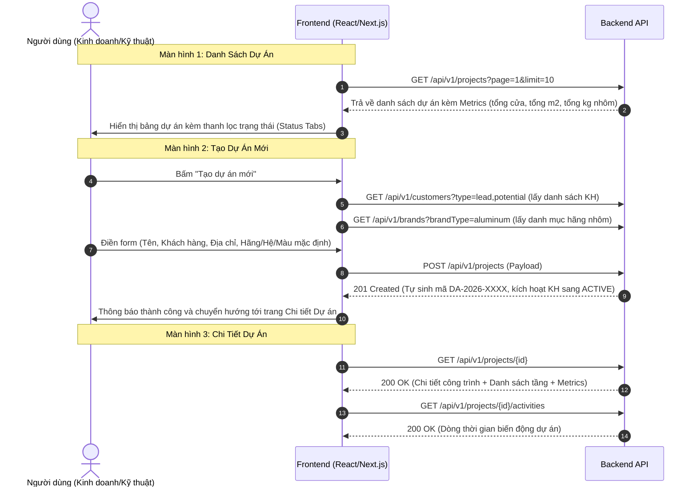

# HƯỚNG DẪN TÍCH HỢP FRONTEND: KHỞI TẠO & QUẢN LÝ DỰ ÁN (MODULE 001)

Module này chịu trách nhiệm quản lý thông tin tổng quan của công trình/dự án nhôm kính, thiết lập cấu hình vật tư mặc định (Hãng nhôm, Hệ nhôm, Màu nhôm) và theo dõi nhật ký hoạt động (Audit Activities).

---

## 1. Luồng Thao Tác Của Người Dùng Trên Frontend (UX Flow)



---

## 2. Chi Tiết Các API Call & Chuẩn Dữ Liệu

### 2.1. Lấy Danh Sách Dự Án (Pagination & Metrics)
- **Endpoint:** `GET /api/v1/projects`
- **Tác dụng:** Lấy danh sách dự án có phân trang, tìm kiếm và tự động tính toán tổng số lượng cửa, diện tích $m^2$, trọng lượng nhôm $kg$ của từng dự án thông qua subquery tối ưu (0 lỗi N+1 Query).
- **Query Parameters:**
  | Tham số | Kiểu | Bắt buộc | Mô tả |
  | :--- | :--- | :--- | :--- |
  | `page` | number | Không | Trang hiện tại (mặc định 1) |
  | `limit` | number | Không | Số bản ghi mỗi trang (mặc định 10) |
  | `status` | string | Không | Lọc theo trạng thái: `draft`, `surveying`, `quotation`, `contract`, `producing`, `installing`, `completed` |
  | `search` | string | Không | Tìm kiếm theo tên dự án, mã dự án, địa chỉ |
  | `customerId` | number | Không | Lọc theo ID khách hàng |

- **Response Body (200 OK):**
  ```json
  {
    "success": true,
    "data": [
      {
        "id": 58,
        "code": "DA-2026-0031",
        "name": "Biệt thự E2E Clean Test",
        "customerId": 47,
        "status": "surveying",
        "address": "99 Đại Lộ Thăng Long, Hà Nội",
        "totalPositions": 3,
        "totalAreaM2": 11.312,
        "totalAluminumKg": 134.4,
        "createdAt": "2026-10-08T09:41:14Z",
        "customer": {
          "id": 47,
          "name": "Nguyễn Văn A",
          "phone": "0987654321"
        }
      }
    ],
    "meta": {
      "page": 1,
      "limit": 10,
      "total": 1,
      "totalPages": 1
    }
  }
  ```

---

### 2.2. Tạo Mới Dự Án
- **Endpoint:** `POST /api/v1/projects`
- **HTTP Status Trả Về:** `201 Created`
- **Tác dụng:** Khởi tạo dự án mới, tự động sinh mã chuẩn định dạng `DA-YYYY-XXXX` nếu `code` để trống, đồng thời tự động cập nhật trạng thái khách hàng liên kết từ `LEAD`/`POTENTIAL` sang `ACTIVE`.
- **Request Headers:**
  - `Authorization: Bearer <TOKEN>`
  - `Content-Type: application/json`

- **Request Body:**
  ```json
  {
    "name": "Công trình Biệt thự Vườn Ecopark",
    "customerId": 47,
    "status": "surveying",
    "address": "Khu Thảo Nguyên, KĐT Ecopark",
    "note": "Khách yêu cầu dùng hệ Xingfa Class A Anodize",
    "defaultBrandId": 1,
    "defaultSeriesId": 2,
    "defaultColorId": 3,
    "startDate": "2026-10-15",
    "targetDate": "2026-12-30"
  }
  ```
  *(Lưu ý: Nếu người dùng muốn tự nhập mã dự án tùy biến thì gửi thêm field `"code": "DA-MYCODE-01"`. Backend sẽ kiểm tra trùng lặp và trả về 400 nếu đã tồn tại).*

---

### 2.3. Lấy Chi Tiết Dự Án
- **Endpoint:** `GET /api/v1/projects/{id}`
- **Tác dụng:** Nạp toàn bộ dữ liệu cấu hình dự án, danh sách các tầng (`floors` đã sắp xếp theo `orderIndex`), thông tin nhân viên phụ trách (`user`), thông tin khách hàng (`customer`).
- **Response Body (200 OK):**
  ```json
  {
    "id": 58,
    "code": "DA-2026-0031",
    "name": "Biệt thự E2E Clean Test",
    "customerId": 47,
    "status": "surveying",
    "address": "99 Đại Lộ Thăng Long, Hà Nội",
    "defaultBrandId": 1,
    "defaultSeriesId": 2,
    "defaultColorId": 3,
    "totalPositions": 3,
    "totalAreaM2": 11.312,
    "totalAluminumKg": 134.4,
    "floors": [
      { "id": 46, "name": "Tầng 1", "orderIndex": 1 },
      { "id": 47, "name": "Tầng 2", "orderIndex": 2 }
    ],
    "defaultBrand": { "id": 1, "name": "Xingfa Quảng Đông" },
    "defaultSeries": { "id": 2, "name": "Hệ 55 vát cạnh" },
    "defaultColor": { "id": 3, "name": "Màu Ghi Xám Metallic" }
  }
  ```

---

### 2.4. Cập Nhật Thông Tin Dự Án
- **Endpoint:** `PUT /api/v1/projects/{id}`
- **Request Body:** Gửi các trường cần cập nhật (partial update):
  ```json
  {
    "name": "Biệt thự E2E Clean Test (Đã cập nhật)",
    "status": "designing",
    "handoverDate": "2026-12-25"
  }
  ```

---

### 2.5. Xóa Mềm Dự Án (Soft Delete)
- **Endpoint:** `DELETE /api/v1/projects/{id}`
- **Tác dụng:** Đánh dấu xóa mềm (`deletedAt = now(timezone.utc)`), giữ nguyên dữ liệu trong DB để audit lịch sử, tự động loại trừ khỏi danh sách tìm kiếm thông thường.

---

### 2.6. Nhật Ký Hoạt Động Của Dự Án (Activity Timeline)
- **Endpoint:** `GET /api/v1/projects/{id}/activities`
- **Tác dụng:** Trả về toàn bộ lịch sử biến động từ lúc tạo dự án, thêm tầng, duyệt báo giá, ký hợp đồng, xuất kho đến nghiệm thu cửa.
- **Response Body:**
  ```json
  {
    "data": [
      {
        "id": 102,
        "actionType": "create",
        "actionCategory": "project",
        "actionTitle": "Khởi tạo dự án mới: DA-2026-0031 - Biệt thự E2E Clean Test",
        "createdAt": "2026-10-08T09:41:14Z",
        "actorType": "user"
      }
    ]
  }
  ```

---

## 3. Bảng Ánh Xạ Từ Điển (Dictionary Mapping) Cho Frontend

Theo **Quy chuẩn 2**, Backend trả mã tiếng Anh, Frontend dùng bảng ánh xạ sau để hiển thị nhãn tiếng Việt và màu sắc badge:

```typescript
export const PROJECT_STATUS_MAP: Record<string, { label: string; color: string }> = {
  draft:       { label: 'Dự thảo',        color: 'gray' },
  surveying:   { label: 'Đang khảo sát',  color: 'blue' },
  designing:   { label: 'Thiết kế bóc tách', color: 'cyan' },
  quotation:   { label: 'Lập báo giá',    color: 'orange' },
  contract:    { label: 'Đã ký hợp đồng', color: 'purple' },
  producing:   { label: 'Đang sản xuất',  color: 'geekblue' },
  installing:  { label: 'Đang lắp đặt',   color: 'magenta' },
  completed:   { label: 'Hoàn thành',     color: 'green' },
  cancelled:   { label: 'Đã hủy',         color: 'red' }
};
```
