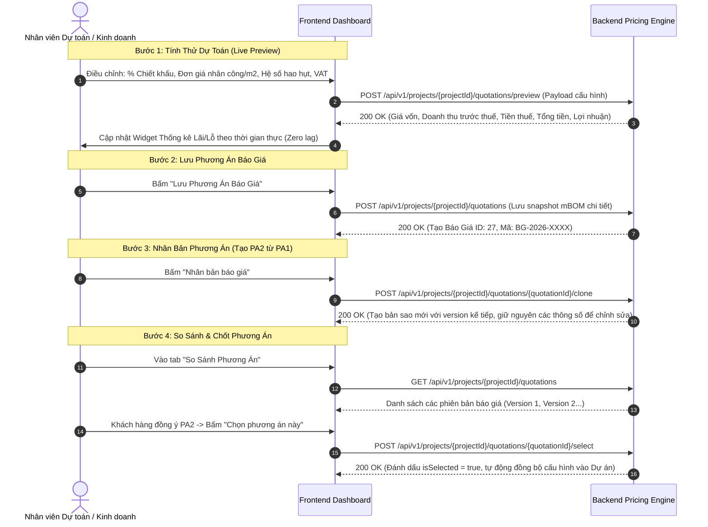

# HƯỚNG DẪN TÍCH HỢP FRONTEND: BÁO GIÁ & PRICING ENGINE (MODULE 003)

Module này cung cấp công cụ tính giá tự động (**Pricing Engine**), cho phép tạo nhiều phương án báo giá (Phương án 1 - Tiêu chuẩn, Phương án 2 - Cao cấp) để chủ đầu tư so sánh, nhân bản báo giá (`clone`), đóng băng bản bóc tách vật tư (**mBOM Snapshot**) và chốt phương án chính thức làm căn cứ ký hợp đồng.

---

## 1. Luồng Thao Tác Của Người Dùng Trên Frontend (UX Flow)



---

## 2. Chi Tiết Các API Call & Chuẩn Dữ Liệu

### 2.1. Tính Dự Toán Nháp (Preview Pricing Engine)
- **Endpoint:** `POST /api/v1/projects/{projectId}/quotations/preview`
- **Tác dụng:** Chạy thuật toán định giá đa biến, bóc tách giá nhôm theo kg, kính theo $m^2$, phụ kiện theo bộ/chiếc, nhân công sản xuất & lắp đặt, chiết khấu và thuế VAT. Không lưu vào Database, phục vụ giao diện kéo trượt slider / đổi cấu hình trực tiếp.
- **Request Body:**
  ```json
  {
    "projectId": 58,
    "discountPercent": 5.0,
    "vatPercent": 10.0,
    "laborCalcUnit": "vnd_per_m2",
    "laborCostPerUnit": 250000.0,
    "installationCostPerUnit": 150000.0,
    "transportFee": 1500000.0,
    "wastePercent": 5.0
  }
  ```
- **Response Body (200 OK):**
  ```json
  {
    "totalCostPrice": 33603504,
    "subtotalBeforeTax": 41931105,
    "vatAmount": 4193110,
    "totalPrice": 46124215,
    "grossProfit": 8327601,
    "profitMarginPercent": 19.86,
    "totalAreaM2": 11.312,
    "totalAluminumKg": 134.4
  }
  ```

---

### 2.2. Lưu Phương Án Báo Giá Chính Thức (Save Quotation)
- **Endpoint:** `POST /api/v1/projects/{projectId}/quotations`
- **Tác dụng:** Đóng băng toàn bộ giá thành và danh mục vật tư thành snapshot JSON (`snapshotItems`), cấp mã tự động `BG-YYYY-XXXX`.
- **Request Body:**
  ```json
  {
    "projectId": 58,
    "name": "Phương án 1 - Xingfa Class A Anodize",
    "discountPercent": 5.0,
    "vatPercent": 10.0,
    "laborCalcUnit": "vnd_per_m2",
    "laborCostPerUnit": 250000.0,
    "installationCostPerUnit": 150000.0,
    "transportFee": 1500000.0,
    "note": "Báo giá có hiệu lực trong vòng 15 ngày"
  }
  ```
- **Response Body (200 OK):**
  ```json
  {
    "id": 27,
    "code": "BG-2026-0012",
    "name": "Phương án 1 - Xingfa Class A Anodize",
    "version": 1,
    "status": "draft",
    "isSelected": false,
    "isLocked": false,
    "totalPrice": 46124215,
    "subtotalBeforeTax": 41931105,
    "vatAmount": 4193110,
    "snapshotItems": [
      {
        "positionCode": "D1-01",
        "doorName": "Cửa đi chính 4 cánh",
        "aluminumWeightKg": 52.4,
        "glassAreaM2": 4.3891,
        "lineTotal": 21500000
      }
    ]
  }
  ```

---

### 2.3. Lấy Danh Sách & Chi Tiết Báo Giá
- **Lấy danh sách các phương án báo giá của dự án:** `GET /api/v1/projects/{projectId}/quotations`
- **Lấy chi tiết 1 phương án báo giá:** `GET /api/v1/projects/{projectId}/quotations/{quotationId}`
- **Cập nhật phương án báo giá:** `PUT /api/v1/projects/{projectId}/quotations/{quotationId}`
  *(Lưu ý: Nếu báo giá đã bị khóa `isLocked = true` do hợp đồng đã ký kết, Backend sẽ chặn sửa và trả về mã lỗi 403 Forbidden).*
- **Xóa báo giá:** `DELETE /api/v1/projects/{projectId}/quotations/{quotationId}`

---

### 2.4. Nhân Bản Báo Giá (Clone Quotation)
- **Endpoint:** `POST /api/v1/projects/{projectId}/quotations/{quotationId}/clone`
- **Tác dụng:** Tự động copy toàn bộ dữ liệu của báo giá cũ sang một báo giá mới, tự động tăng chỉ số phiên bản (`version = version + 1`), đặt tên dạng *"Bản sao - [Tên cũ]"*, cho phép nhân viên kinh doanh nhanh chóng điều chỉnh hệ số để chào giá khách hàng.

---

### 2.5. Chọn Phương Án Chính Thức (Select Official Quotation)
- **Endpoint:** `POST /api/v1/projects/{projectId}/quotations/{quotationId}/select`
- **Tác dụng:** Khi khách hàng đồng ý chốt phương án nào, nhấn chọn phương án đó. Backend sẽ:
  1. Chuyển `isSelected = true` cho báo giá được chọn.
  2. Tự động chuyển tất cả các báo giá khác của dự án về `isSelected = false`.
  3. Cập nhật trạng thái dự án sang `quotation` hoặc sẵn sàng chuyển sang ký Hợp đồng (`contract`).

---

## 3. Bảng Ánh Xạ Từ Điển (Dictionary Mapping) Cho Frontend

```typescript
export const QUOTATION_STATUS_MAP: Record<string, { label: string; color: string }> = {
  draft:     { label: 'Bản thảo',   color: 'default' },
  sent:      { label: 'Đã gửi khách', color: 'blue' },
  approved:  { label: 'Đã chốt',    color: 'success' },
  rejected:  { label: 'Từ chối',    color: 'error' }
};

export const LABOR_CALC_UNIT_MAP: Record<string, string> = {
  vnd_per_m2:    'VNĐ / m²',
  vnd_per_kg:    'VNĐ / kg',
  vnd_per_item:  'VNĐ / bộ',
  vnd_lump_sum:  'Khoán trọn gói'
};
```
