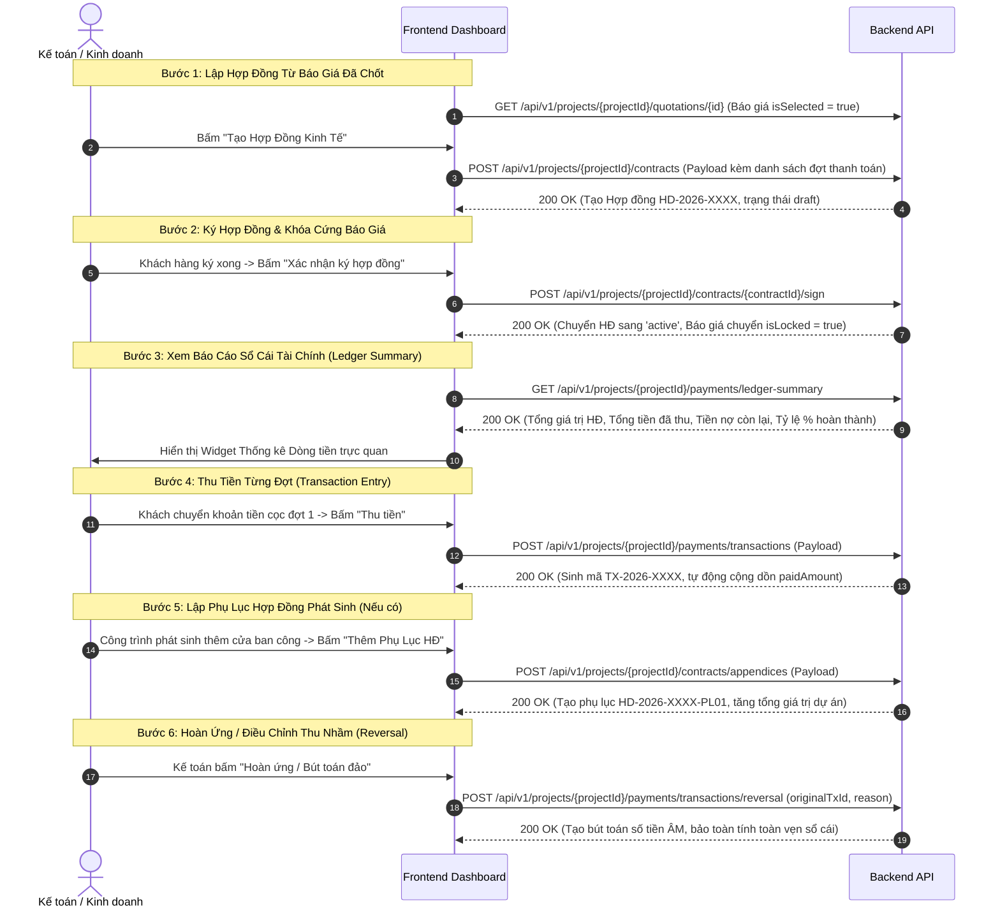

# HƯỚNG DẪN TÍCH HỢP FRONTEND: HỢP ĐỒNG & SỔ CÁI THANH TOÁN (MODULE 004)

Module này quản lý việc ký kết hợp đồng kinh tế dựa trên phương án báo giá đã chốt, lập phụ lục hợp đồng (`appendices`), chia các mốc thanh toán theo tiến độ thi công, theo dõi báo cáo tổng kết tài chính (`ledger-summary`), và vận hành cơ chế **Sổ cái kế toán bất biến (Immutable Financial Ledger)** với bút toán giao dịch (`transactions`) và bút toán đảo (`reversal`).

---

## 1. Luồng Thao Tác Của Người Dùng Trên Frontend (UX Flow)



---

## 2. Chi Tiết Các API Call & Chuẩn Dữ Liệu

### 2.1. Tạo Hợp Đồng Mới
- **Endpoint:** `POST /api/v1/projects/{projectId}/contracts`
- **Tác dụng:** Tự sinh mã `HD-YYYY-XXXX`, chia nhỏ giá trị hợp đồng thành các đợt thanh toán (`paymentStages`).
- **Request Body:**
  ```json
  {
    "quotationId": 27,
    "title": "Hợp đồng thi công lắp đặt cửa nhôm kính Ecopark",
    "contractType": "main",
    "paymentStages": [
      {
        "milestoneName": "Tạm ứng đợt 1 (Ký hợp đồng)",
        "percentage": 40.0,
        "dueDate": "2026-10-20",
        "description": "Tạm ứng mua nguyên vật liệu nhôm kính"
      },
      {
        "milestoneName": "Thanh toán đợt 2 (Giao hàng đến chân công trình)",
        "percentage": 40.0,
        "dueDate": "2026-11-15",
        "description": "Tập kết cửa tại tầng 1"
      },
      {
        "milestoneName": "Quyết toán đợt 3 (Nghiệm thu bàn giao)",
        "percentage": 20.0,
        "dueDate": "2026-12-05",
        "description": "Bàn giao chìa khóa và bảo hành"
      }
    ]
  }
  ```
- **Response Body (200 OK):**
  ```json
  {
    "id": 13,
    "contractCode": "HD-2026-0009",
    "title": "Hợp đồng thi công lắp đặt cửa nhôm kính Ecopark",
    "totalValue": 46124215,
    "status": "draft",
    "payments": [
      {
        "id": 19,
        "milestoneName": "Tạm ứng đợt 1 (Ký hợp đồng)",
        "amount": 18449686,
        "paidAmount": 0,
        "status": "pending"
      }
    ]
  }
  ```

---

### 2.2. Lập Phụ Lục Hợp Đồng Phát Sinh (Appendices)
- **Endpoint:** `POST /api/v1/projects/{projectId}/contracts/appendices`
- **Tác dụng:** Lập phụ lục hợp đồng khi công trình có phát sinh thêm hạng mục cửa hoặc thay đổi vật tư sau khi đã ký hợp đồng chính thức.
- **Request Body:**
  ```json
  {
    "parentContractId": 13,
    "title": "Phụ lục 01: Bổ sung 2 bộ cửa sổ trượt tầng tum",
    "additionalValue": 8500000,
    "note": "Khách hàng duyệt thiết kế ngày 20/10",
    "paymentStages": [
      {
        "milestoneName": "Thanh toán 100% khi nghiệm thu phụ lục",
        "percentage": 100.0,
        "dueDate": "2026-11-20"
      }
    ]
  }
  ```

---

### 2.3. Ký Hợp Đồng & Khóa Báo Giá
- **Endpoint:** `POST /api/v1/projects/{projectId}/contracts/{contractId}/sign`
- **Tác dụng:**
  - Chuyển trạng thái Hợp đồng sang `active`.
  - Khóa vĩnh viễn Báo giá liên kết (`isLocked = true`). Nếu bất kỳ ai cố tình sửa báo giá sau khi đã ký HĐ, Backend sẽ ném lỗi chặn `ForbiddenException` (HTTP 403).
  - Tự động nâng trạng thái dự án lên `contract`.

---

### 2.4. Báo Cáo Sổ Cái Tài Chính Dự Án (Ledger Summary)
- **Endpoint:** `GET /api/v1/projects/{projectId}/payments/ledger-summary`
- **Tác dụng:** Trả về bức tranh tài chính tức thời của dự án để FE vẽ Card tổng quan.
- **Response Body (200 OK):**
  ```json
  {
    "projectId": 58,
    "totalContractValue": 46124215,
    "totalPaidAmount": 18449686,
    "remainingAmount": 27674529,
    "paymentProgressPercent": 40.0,
    "totalPaymentsCount": 3,
    "completedPaymentsCount": 1
  }
  ```

---

### 2.5. Lập Bút Toán Thu Tiền & Bút Toán Đảo Hoàn Ứng
- **Danh sách bút toán giao dịch:** `GET /api/v1/projects/{projectId}/payments/transactions`
- **Lập bút toán thu tiền:** `POST /api/v1/projects/{projectId}/payments/transactions`
  - Request Body:
    ```json
    {
      "paymentId": 19,
      "amount": 18449686,
      "paymentMethod": "bank_transfer",
      "referenceCode": "MBBANK_FT12345678",
      "receiptProofUrl": "https://cdn.xttech.vn/proofs/mb_tx123.jpg",
      "note": "Khách hàng Nguyễn Văn A chuyển khoản cọc đợt 1"
    }
    ```
- **Lập bút toán đảo (Reversal Transaction):** `POST /api/v1/projects/{projectId}/payments/transactions/reversal`
  - Request Body:
    ```json
    {
      "originalTransactionId": 19,
      "reversalReason": "Khách chuyển nhầm dư tiền cần hoàn trả lại tài khoản chính chủ"
    }
    ```
  - Cơ chế kế toán: Sinh bút toán mới có `amount = -18449686`, không xóa dòng cũ.

---

## 3. Bảng Ánh Xạ Từ Điển (Dictionary Mapping) Cho Frontend

```typescript
export const CONTRACT_STATUS_MAP: Record<string, { label: string; color: string }> = {
  draft:       { label: 'Dự thảo',      color: 'default' },
  active:      { label: 'Có hiệu lực',  color: 'success' },
  completed:   { label: 'Thanh lý',     color: 'blue' },
  terminated:  { label: 'Hủy hợp đồng', color: 'error' }
};

export const PAYMENT_METHOD_MAP: Record<string, string> = {
  cash:          'Tiền mặt',
  bank_transfer: 'Chuyển khoản ngân hàng',
  credit_card:   'Thẻ tín dụng / POS',
  other:         'Khác'
};
```
