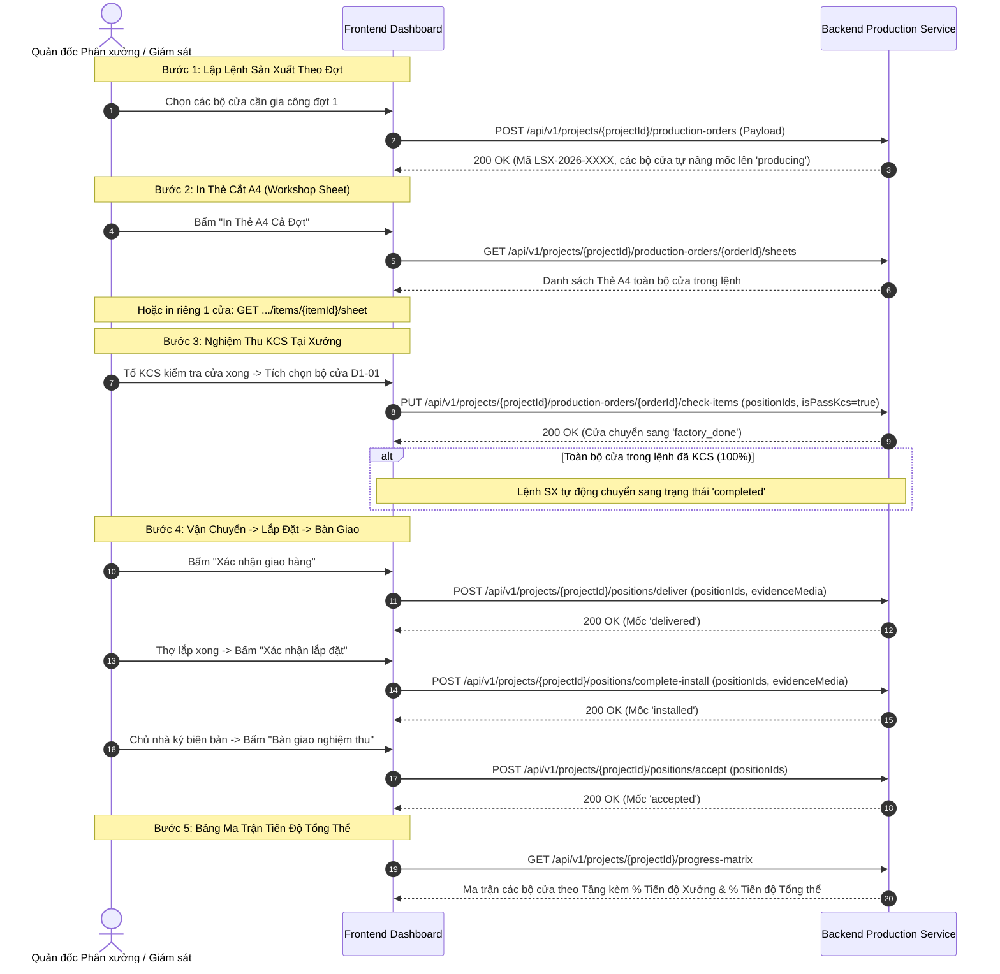

# HƯỚNG DẪN TÍCH HỢP FRONTEND: SẢN XUẤT, THẺ CẮT A4 & MA TRẬN TIẾN ĐỘ (MODULE 005)

Module này số hóa toàn bộ quá trình sản xuất tại phân xưởng và thi công ngoài công trình: Gom các bộ cửa thành **Lệnh sản xuất (Production Orders)** theo đợt thi công, hủy lệnh (`cancel`), kết xuất **Thẻ cắt A4 toàn đợt hoặc từng bộ cửa riêng lẻ**, kiểm soát chất lượng KCS với cơ chế **tự động đóng đợt khi hoàn tất 100%**, ghi nhận giao hàng/lắp đặt/bàn giao kèm ảnh hiện trường, và hiển thị **Bảng ma trận tiến độ (Progress Matrix)** tính theo trọng số diện tích $m^2$.

---

## 1. Luồng Thao Tác Của Người Dùng Trên Frontend (UX Flow)



---

## 2. Chi Tiết Các API Call & Chuẩn Dữ Liệu

### 2.1. Lập & Quản Lý Lệnh Sản Xuất
- **Lập lệnh sản xuất mới:** `POST /api/v1/projects/{projectId}/production-orders`
  - Request Body:
    ```json
    {
      "title": "Sản xuất đợt 1 - Cửa đi phòng khách & Cửa sổ bếp",
      "startDate": "2026-10-18",
      "targetDate": "2026-10-25",
      "positionIds": [107, 108],
      "note": "Ưu tiên cắt trước bộ cửa mặt tiền"
    }
    ```
- **Lấy danh sách lệnh SX của dự án:** `GET /api/v1/projects/{projectId}/production-orders`
- **Chi tiết 1 lệnh SX:** `GET /api/v1/projects/{projectId}/production-orders/{orderId}`
- **Hủy lệnh sản xuất:** `POST /api/v1/projects/{projectId}/production-orders/{orderId}/cancel`
  *(Tác dụng: Hủy lệnh gia công và giải phóng các bộ cửa về trạng thái khảo sát ban đầu).*

---

### 2.2. Lấy Dữ Liệu In Thẻ Cắt A4 (Workshop Sheet)
- **In toàn bộ Thẻ A4 của đợt sản xuất:** `GET /api/v1/projects/{projectId}/production-orders/{orderId}/sheets`
- **In riêng Thẻ A4 cho 1 bộ cửa đơn lẻ:** `GET /api/v1/projects/{projectId}/production-orders/{orderId}/items/{itemId}/sheet`
- **Cấu trúc dữ liệu Thẻ A4:**
  ```json
  {
    "productionOrderId": 14,
    "orderCode": "LSX-2026-0015",
    "sheets": [
      {
        "positionCode": "D1-01",
        "doorName": "Cửa đi chính 4 cánh",
        "floorName": "Tầng 1",
        "width": 2800.0,
        "height": 2400.0,
        "aluminumProfiles": [
          { "barCode": "XF55-KB", "barName": "Khung bao", "cutLength": 2800.0, "angleLeft": 45, "angleRight": 45, "quantity": 2 }
        ],
        "glasses": [
          { "glassType": "Kính cường lực 8mm", "width": 550.0, "height": 2150.0, "quantity": 4 }
        ],
        "accessories": [
          { "itemCode": "ACC-BL4D", "itemName": "Bản lề 4D Kinlong", "quantity": 12, "unit": "pcs" }
        ]
      }
    ]
  }
  ```

---

### 2.3. Nghiệm Thu KCS Xưởng & Tự Động Đóng Đợt
- **Endpoint:** `PUT /api/v1/projects/{projectId}/production-orders/{orderId}/check-items`
- **Request Body:**
  ```json
  {
    "positionIds": [107],
    "isPassKcs": true,
    "kcsNote": "Ép góc khít, gioăng cao su lắp phẳng, bọc màng PE bảo vệ"
  }
  ```
- **Cơ chế tự động:** Khi nghiệm thu đến bộ cửa cuối cùng của lệnh (tỷ lệ KCS = 100%), lệnh sản xuất sẽ **tự động chuyển trạng thái sang `completed`**.

---

### 2.4. Xác Nhận Giao Hàng, Lắp Đặt & Nghiệm Thu Bàn Giao
Các endpoint này dùng Pydantic schema chuẩn **`camelCase`** (`positionIds`, `evidenceMedia`):

1. **Giao hàng đến chân công trình:**
   - `POST /api/v1/projects/{projectId}/positions/deliver`
   - Request Body:
     ```json
     {
       "positionIds": [107],
       "note": "Xe tải chở tập kết tại tầng 1 công trình",
       "evidenceMedia": ["https://cdn.xttech.vn/proofs/delivery_p1.jpg"]
     }
     ```
2. **Lắp đặt hoàn thiện:**
   - `POST /api/v1/projects/{projectId}/positions/complete-install`
   - Request Body:
     ```json
     {
       "positionIds": [107],
       "note": "Tổ lắp đặt đã cân chỉnh bản lề và bắn keo silicon kín khít",
       "evidenceMedia": ["https://cdn.xttech.vn/proofs/install_p1.jpg"]
     }
     ```
3. **Chủ nhà ký biên bản bàn giao nghiệm thu:**
   - `POST /api/v1/projects/{projectId}/positions/accept`
   - Request Body:
     ```json
     {
       "positionIds": [107],
       "note": "Chủ nhà ký biên bản bàn giao không lỗi"
     }
     ```

---

### 2.5. Bảng Ma Trận Tiến Độ Tổng Thể (Progress Matrix)
- **Endpoint:** `GET /api/v1/projects/{projectId}/progress-matrix`
- **Response Body (200 OK):**
  ```json
  {
    "projectId": 58,
    "totalPositions": 3,
    "factoryProgressPercent": 87.8,
    "overallProgressPercent": 84.6,
    "matrix": [
      {
        "floorId": 46,
        "floorName": "Tầng 1",
        "positions": [
          { "id": 107, "code": "D1-01", "name": "Cửa đi 4 cánh", "areaM2": 6.72, "status": "accepted" },
          { "id": 108, "code": "S1-01", "name": "Cửa sổ lùa", "areaM2": 2.24, "status": "factory_done" }
        ]
      }
    ]
  }
  ```

---

### 2.6. Lịch Sử Biến Động Tiến Độ Của 1 Cửa (Progress History)
- **Endpoint:** `GET /api/v1/projects/{projectId}/positions/{positionId}/progress-history`
- **Tác dụng:** Trả về toàn bộ nhật ký event-sourcing từng mốc biến động của một vị trí cửa (ai cập nhật, ngày giờ, ảnh chứng cứ đính kèm, ghi chú).

---

## 3. Bảng Ánh Xạ Từ Điển (Dictionary Mapping) Cho Frontend

```typescript
export const PROGRESS_STEP_MAP: Record<string, { label: string; color: string }> = {
  draft:        { label: 'Bản vẽ sơ bộ',   color: '#d9d9d9' },
  surveyed:     { label: 'Đã đo ô chờ',    color: '#1890ff' },
  producing:    { label: 'Đang sản xuất',  color: '#fa8c16' },
  factory_done: { label: 'Xuất xưởng',     color: '#13c2c2' },
  delivered:    { label: 'Đã giao hàng',   color: '#722ed1' },
  installed:    { label: 'Đã lắp đặt',     color: '#2f54eb' },
  accepted:     { label: 'Bàn giao xong',  color: '#52c41a' }
};
```
