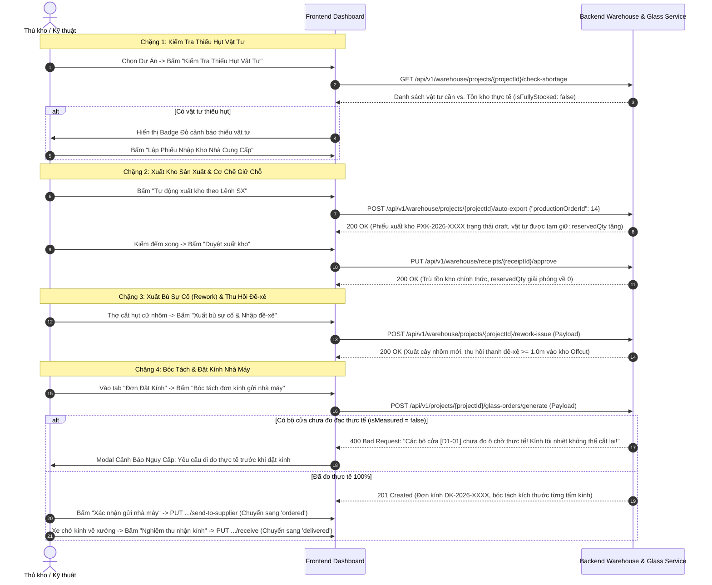

# HƯỚNG DẪN TÍCH HỢP FRONTEND: KHO VẬT TƯ & ĐƠN ĐẶT KÍNH NHÀ MÁY (MODULE 006)

Module này kiểm soát toàn bộ chuỗi cung ứng vật tư của xưởng sản xuất: Quản lý nhà cung cấp, **cảnh báo thiếu hụt vật tư tự động (Material Shortage Checker)**, lập phiếu xuất kho theo Lệnh sản xuất với **cơ chế giữ chỗ (`reservedQty`)**, hàng rào bảo vệ **chống xuất âm kho**, quy trình **xuất bù sự cố (`rework-issue`) & thu hồi nhôm đề-xê**, hủy phiếu kho (`cancel`), và quản lý chu trình **đặt kính nhà máy tôi nhiệt** kèm hàng rào an toàn bắt buộc khảo sát thực tế.

---

## 1. Luồng Thao Tác Của Người Dùng Trên Frontend (UX Flow)



---

## 2. Chi Tiết Các API Call & Chuẩn Dữ Liệu

### 2.1. Quản Lý Nhà Cung Cấp & Danh Mục Mặt Hàng Tồn Kho
- **Danh sách nhà cung cấp:** `GET /api/v1/warehouse/suppliers`
- **Tạo nhà cung cấp mới:** `POST /api/v1/warehouse/suppliers`
- **Cập nhật nhà cung cấp:** `PUT /api/v1/warehouse/suppliers/{supplierId}`
- **Danh mục mặt hàng tồn kho:** `GET /api/v1/warehouse/items`
- **Tạo mặt hàng tồn kho mới:** `POST /api/v1/warehouse/items`
- **Cập nhật thông tin mặt hàng:** `PUT /api/v1/warehouse/items/{itemId}`

---

### 2.2. Cảnh Báo Thiếu Hụt Vật Tư (Shortage Checker)
- **Endpoint:** `GET /api/v1/warehouse/projects/{projectId}/check-shortage`
- **Tác dụng:** Đối soát giữa tổng định mức vật tư của dự án với lượng tồn kho khả dụng hiện tại (`availableStock = currentStock - reservedQty`).
- **Response Body (200 OK):**
  ```json
  {
    "projectId": 58,
    "isFullyStocked": false,
    "totalShortageItems": 2,
    "shortages": [
      {
        "itemCode": "XF55-KB",
        "itemName": "Khung bao Xingfa 55",
        "requiredQty": 8.0,
        "availableQty": 4.0,
        "shortageQty": 4.0,
        "unit": "bar"
      },
      {
        "itemCode": "ACC-BL4D",
        "itemName": "Bản lề 4D Kinlong",
        "requiredQty": 12.0,
        "availableQty": 6.0,
        "shortageQty": 6.0,
        "unit": "pcs"
      }
    ]
  }
  ```

---

### 2.3. Tự Động Sinh Phiếu Xuất Kho & Giữ Chỗ (Auto Export)
- **Endpoint:** `POST /api/v1/warehouse/projects/{projectId}/auto-export`
- **Tác dụng:** Lập phiếu xuất kho (`PXK-YYYY-XXXX`) theo Lệnh sản xuất.
- **Cơ chế giữ chỗ (Stock Reservation):** Khi phiếu xuất được tạo ở trạng thái `draft`, số lượng tồn khả dụng sẽ bị tạm giữ (`reservedQty += requiredQty`). Thao tác này ngăn chặn các lệnh sản xuất khác tranh chấp hoặc xuất vượt quá lượng tồn kho thực tế.

---

### 2.4. Quản Lý Phiếu Kho, Duyệt Nguyên Tử ACID & Hủy Phiếu
- **Danh sách phiếu xuất / nhập kho:** `GET /api/v1/warehouse/receipts`
  - Query parameters: `receiptType` (import/export), `status` (draft/approved/cancelled), `page`, `limit`.
- **Tạo phiếu nhập kho NCC thủ công:** `POST /api/v1/warehouse/receipts`
  - Request Body:
    ```json
    {
      "code": "PNK-2026-0006",
      "receiptType": "import",
      "receiptReason": "purchase",
      "supplierId": 15,
      "note": "Nhập lô nhôm Xingfa 55 từ đại lý Tuấn Mai",
      "items": [
        {
          "itemId": 1,
          "quantity": 10.0,
          "unitPrice": 570000,
          "note": "Nhôm nguyên cây 6m"
        }
      ]
    }
    ```
- **Chi tiết 1 phiếu kho:** `GET /api/v1/warehouse/receipts/{receiptId}`
- **Duyệt phiếu xuất/nhập kho (Atomic ACID):** `PUT /api/v1/warehouse/receipts/{receiptId}/approve`
  - **Bảo vệ chống xuất âm kho:** Backend kiểm tra nghiêm ngặt:
    $$\text{Tồn kho thực tế} \ge \text{Số lượng yêu cầu xuất}$$
    Nếu không đủ tồn kho, Backend lập tức ném lỗi `BadRequestError` (HTTP 400), hủy toàn bộ transaction và bảo vệ kho không bao giờ bị âm.
- **Hủy phiếu kho khi còn ở trạng thái draft:** `PUT /api/v1/warehouse/receipts/{receiptId}/cancel`
  - Tác dụng: Giải phóng số lượng giữ chỗ `reservedQty` về 0 và chuyển trạng thái phiếu sang `cancelled`.

---

### 2.5. Xuất Bù Sự Cố (Rework Issue) & Thu Hồi Đề-xê (Offcut)
- **Endpoint:** `POST /api/v1/warehouse/projects/{projectId}/rework-issue`
- **Tác dụng:** Khi thợ xưởng làm hỏng hoặc cắt hụt cữ nhôm, lập phiếu xuất bù cây nhôm mới và tự động nhập thanh nhôm thừa (đề-xê) có chiều dài $\ge 1.0m$ vào kho đề-xê tái sử dụng.
- **Request Body:**
  ```json
  {
    "productionOrderId": 14,
    "reworkReason": "Thợ cắt hụt cữ thanh đứng cánh 40mm do cữ máy bị xô",
    "responsibleWorker": "Trần Văn Cường (Tổ cắt)",
    "replacementItemId": 1,
    "quantity": 1.0,
    "offcut": {
      "profileBarId": 1,
      "colorId": 3,
      "lengthMm": 2510.0,
      "storageLocation": "Giá đề-xê B2"
    }
  }
  ```
- **Quản lý kho nhôm đề-xê:**
  - `GET /api/v1/warehouse/offcuts` (Lấy danh sách các thanh đề-xê còn khả dụng trong xưởng)
  - `POST /api/v1/warehouse/offcuts` (Nhập thủ công thanh đề-xê thu hồi)

---

### 2.6. Đơn Đặt Kính Nhà Máy & Guardrail Đo Thực Tế
- **Tạo đơn đặt kính tôi nhiệt:** `POST /api/v1/projects/{projectId}/glass-orders/generate`
  - **Hàng rào an toàn sinh tử (Crucial Guardrail):**
    > **Kính cường lực sau khi tôi nhiệt vĩnh viễn không thể cắt gọt lại.** Do đó, Backend kiểm tra cờ `isMeasured` của tất cả các bộ cửa trong đơn:
    > - Nếu có bất kỳ bộ cửa nào có `isMeasured === false`, Backend ném lỗi HTTP 400: *"Không thể lập đơn kính: Các bộ cửa [D1-01] chưa được khảo sát đo ô chờ thực tế (isMeasured = false)! Bắt buộc phải đo thực tế trước khi đặt kính!"*
- **Lấy danh sách đơn kính của dự án:** `GET /api/v1/projects/{projectId}/glass-orders`
- **Lấy chi tiết 1 đơn kính:** `GET /api/v1/projects/{projectId}/glass-orders/{orderId}`
- **Gửi Đơn Cho Nhà Máy:** `PUT /api/v1/projects/{projectId}/glass-orders/{orderId}/send-to-supplier` (Trạng thái chuyển sang `ordered`).
- **Nghiệm Thu Kính Về Xưởng:** `PUT /api/v1/projects/{projectId}/glass-orders/{orderId}/receive` (Trạng thái chuyển sang `delivered`, kèm bằng chứng ảnh giao nhận kính).

---

## 3. Bảng Ánh Xạ Từ Điển (Dictionary Mapping) Cho Frontend

```typescript
export const SUPPLIER_TYPE_MAP: Record<string, string> = {
  aluminum:   'Nhà cung cấp nhôm thanh',
  accessory:  'Nhà cung cấp phụ kiện kim khí',
  glass:      'Nhà máy tôi kính an toàn',
  consumable: 'Vật tư phụ (Keo, gioăng, ốc vít)'
};

export const RECEIPT_REASON_MAP: Record<string, string> = {
  purchase:          'Mua hàng mới',
  production_issue:  'Xuất sản xuất theo lệnh',
  rework_issue:      'Xuất bù sự cố / cắt hỏng',
  offcut_return:     'Nhập kho thu hồi đề-xê',
  adjustment:        'Điều chỉnh kiểm kê kho',
  scrap:             'Thanh lý phế liệu'
};

export const GLASS_ORDER_STATUS_MAP: Record<string, { label: string; color: string }> = {
  draft:      { label: 'Chờ duyệt',          color: 'default' },
  ordered:    { label: 'Đã gửi nhà máy tôi', color: 'processing' },
  delivered:  { label: 'Đã nhận về xưởng',   color: 'success' },
  cancelled:  { label: 'Đã hủy',             color: 'error' }
};
```
